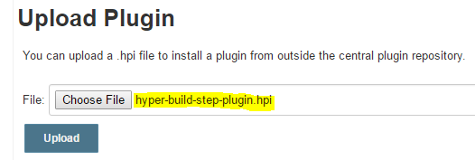
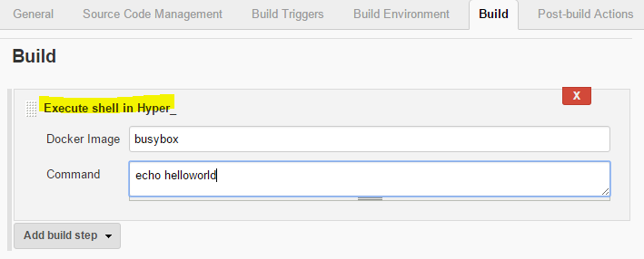
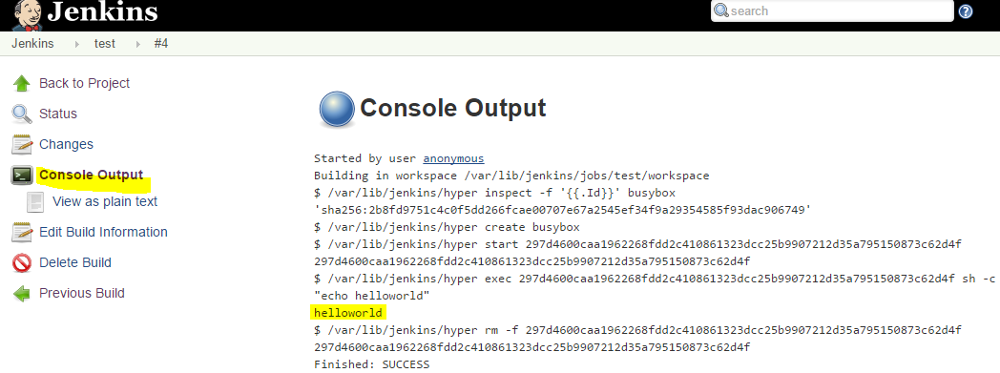

hyper-build-step-plugin
=======================

This plugin allows to add "Execute shell in Hyper_" build step into your job(rely on hyper-commons-plugin).

<!-- TOC depthFrom:1 depthTo:6 withLinks:1 updateOnSave:1 orderedList:0 -->

- [Use plugin](#use-plugin)
	- [Prerequisites](#prerequisites)
	- [Install plugin by manually](#install-plugin-by-manually)
	- [Config job](#config-job)
	- [View build result](#view-build-result)
- [Build plugin](#build-plugin)
	- [Prerequisites](#prerequisites)
	- [Compile](#compile)
	- [Test](#test)
	- [Package](#package)
	- [Install](#install)

<!-- /TOC -->

# Use plugin

## Prerequisites

- Jenkins
- hyper-build-step-plugin.hpi
- Hyper_ credential

## Install plugin by manually

open Jenkins Web UI in web browser

get pre-build `hyper-build-step-plugin.hpi` [here](target/hyper-build-step-plugin.hpi)

```
Manage Jenkins -> Manage Plugins -> Advanced -> Upload Plugin
```



## Config job

```
Config -> Build -> Execute shell in Hyper_
```


## View build result

- click `Build Now` to start build job by manually
- click `Console Output` to view build result




# Build plugin

## Prerequisites

- java 1.7+
- maven 3+

## Compile
```
$ mvn compile
```

## Test

compile + test

```
$ mvn test
```

## Package

> **output**: target/hyper-build-step.hpi

compile + test + package

```
$ mvn package

//skip test
$ mvn package -DskipTests
```

## Install

> **target**: /.m2/repository/sh/hyper/jenkins/hyper-build-step/0.1.0/hyper-build-step-0.1.0.hpi

compile + test + package + install

```
$ mvn install

//skip test
$ mvn install -DskipTests
```
