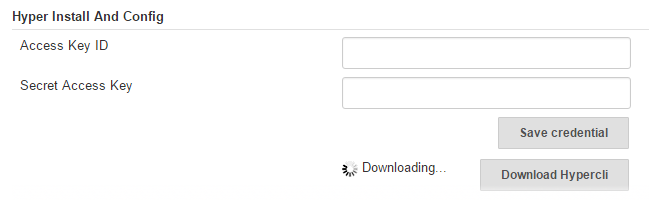

hyper-build-step-plugin
=======================

This plugin allows to add "Execute shell in Hyper_" build step into your job.

<!-- TOC depthFrom:1 depthTo:6 withLinks:1 updateOnSave:1 orderedList:0 -->

- [Features](#features)
- [Use plugin](#use-plugin)
	- [Install plugin by manually](#install-plugin-by-manually)
	- [Config plugin](#config-plugin)
	- [Config job](#config-job)
	- [View build result](#view-build-result)
- [Build](#build)
	- [Compile](#compile)
	- [Test](#test)
	- [Package](#package)
	- [Install](#install)

<!-- /TOC -->

# Features
Plugin currently support following features:

- Install hyper cli
- Set Hyper_ credentials
- Add build step "Execute shell in Hyper_" into job


# Use plugin

## Install plugin by manually

open Jenkins Web UI in web browser

```
Manage Jenkins -> Manage Plugins -> Advanced -> Upload Plugin
```


## Config plugin

login https://console.hyper.sh to get a credential.

```
Manage Jenkins -> Configure System -> Hyper Install And Config
```


## Config job

```
Config -> Build -> Execute shell in Hyper_
```


## View build result

- click `Build Now` to start build job by manually
- click `Console Output` to view build result


# Build

## Compile
```
$ mvn compile
```

## Test

compile + test

```
$ mvn test
```

## Package

> **output**: target/hyper-build-step-plugin.hpi

compile + test + package

```
$ mvn package

//skip test
$ mvn package -DskipTests
```

## Install

> **target**: ~/.m2/repository/hyper-build-step/hyper-build-step-plugin/1.0-SNAPSHOT/hyper-build-step-plugin-1.0-SNAPSHOT.hpi

compile + test + package + install

```
$ mvn install

//skip test
$ mvn install -DskipTests
```
